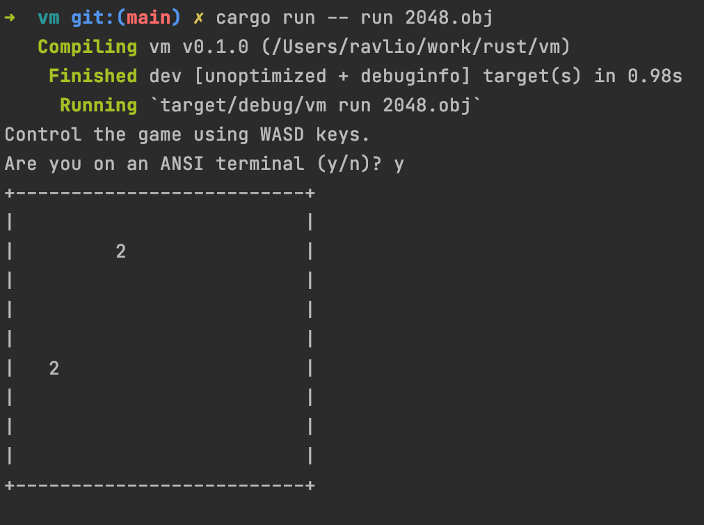

# LC-3 interpreter

A simple virtual machine over the [LC-3 instruction set](https://justinmeiners.github.io/lc3-vm/supplies/lc3-isa.pdf)

## Usage 
cargo run -- run file.obj

## Credits

[2048 Author](https://github.com/rpendleton/lc3-2048)